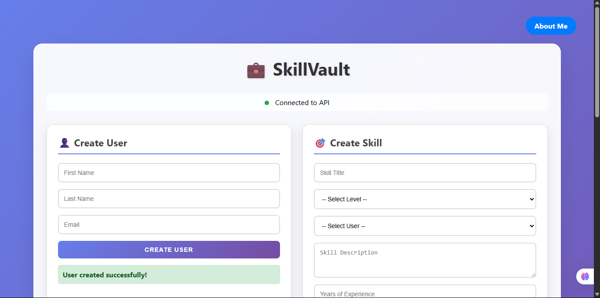

# 🛠️ Skill Vault API

Skill Vault is a simple yet powerful web application built with **Django** and **Django REST Framework** that allows users to showcase their skills and experience. It supports full **CRUD operations** and is designed to serve as a foundation for a much larger project called **Hireform**—an end-to-end platform that connects employers with job seekers.

---

## 🚀 Purpose of the Project

This project was primarily built to:

- Strengthen my understanding of **CRUD operations** using Django REST Framework.
- Implement **Foreign Key relationships** between models.
- Practice real-world API design and testing.
- Simulate a minimal version of a job-seeking platform where:
  - Users can **create and manage** their profiles.
  - Employers can **view, update, or delete** user records based on relevance

---

## 🧱 Tech Stack

- **Backend**: Django, Django REST Framework
- **Database**: SQLite (for development)
- **Hosting**: Railway
- **Frontend Test**: HTML + JavaScript (Fetch API for integration)

---

## 🔄 CRUD Operations Implemented

| Operation  | Endpoint                       | Description                        |
| ---------- | ------------------------------ | ---------------------------------- |
| **Create** | `/api/users/`                  | Create new user and assign skills  |
| **Read**   | `/api/users/` & `/api/skills/` | Retrieve users and their skills    |
| **Update** | `/api/users/<id>/`             | Update user's experience or skills |
| **Delete** | `/api/users/<id>/`             | Remove a user and their data       |

---

## 🧠 What I Learned

- How to model relational data using **ForeignKey** in Django.
- Serializing nested relationships.
- Implementing **APIView**, **ModelViewSet**, and **Router**.
- Writing clean, reusable code using DRF best practices.
- How to deploy a Django API to **Railway**.
- Handling **CORS** and basic **Fetch API** integration with HTML.

---

## 😓 Challenges Faced

- 🔁 **Serializer depth confusion** when nesting models.
- 🔐 Properly validating data for both `User` and `Skill` models.
- 🧩 Managing CORS issues when connecting the API to the frontend.
- 🔧 Dealing with broken fetch requests due to wrong URL paths and async handling.
- 🚨 Handling “Method Not Allowed” and status codes errors when testing endpoints.
- 🧠 Switching between **function-based** and **class-based** views before settling.
- 🧵 Cleaning up the JSON structure so it's readable and user-friendly.

---

## 🔭 What's Next?

Skill Vault is just the beginning. It's a **component of a larger ecosystem** called **Hireform**, where:

- Employers will be able to **post job listings**.
- A public link will be generated so applicants can **apply via a form**.
- Applications will be stored, filtered, and viewed through a clean dashboard.
- AI bots will help screen candidates based on their skill relevance.

---

## 🌐 Live Demo

You can test the live prototype here:  
👉 [Skill Vault API](https://skill-vault-api-production-f6fb.up.railway.app/)

---

## 🤝 Contributing

Want to contribute? Feel free to fork the repo, open issues, or submit pull requests!

---

## 📜 License

This project is licensed under the MIT License.

---

## 🙏 Acknowledgements

- My mentors, friends, and my brother who reminded me:  
  _"Whatever little you know, you can teach and make money from it—just learn how to market yourself."_ 💡
